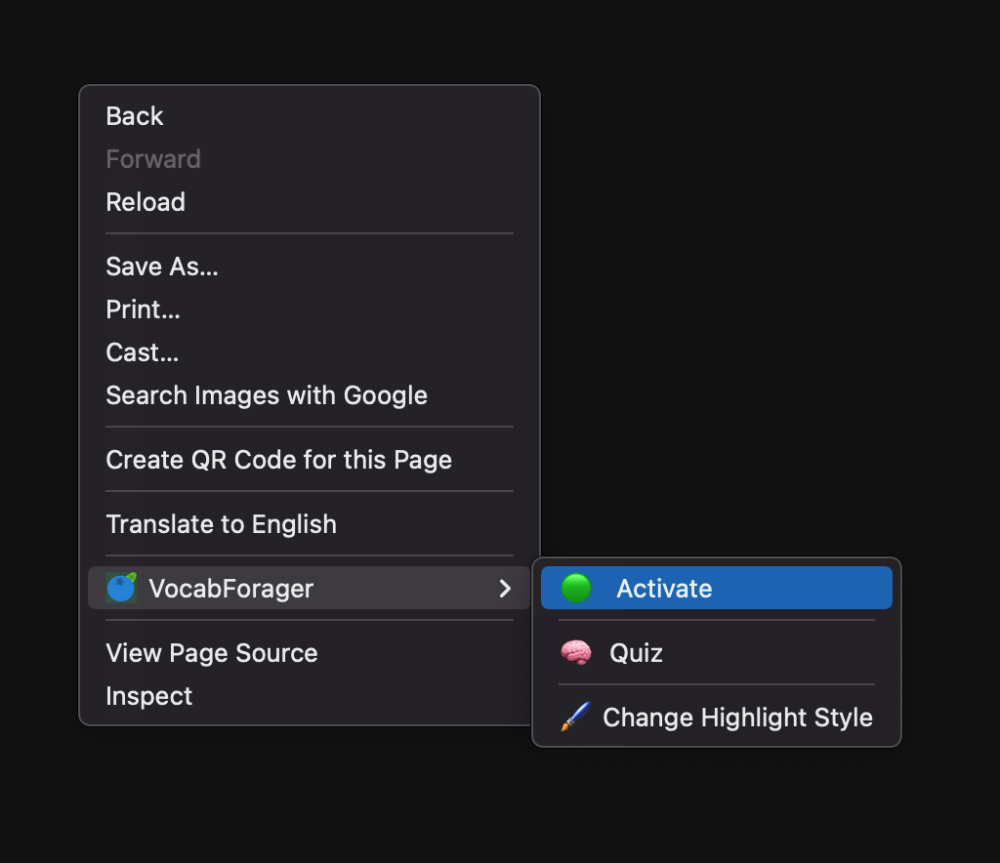
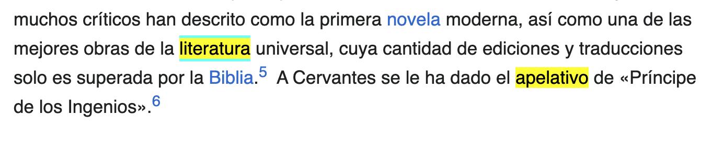
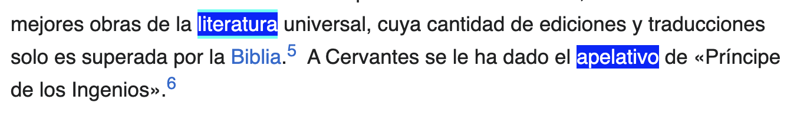
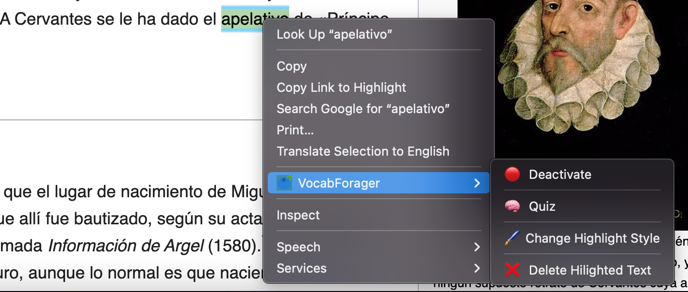
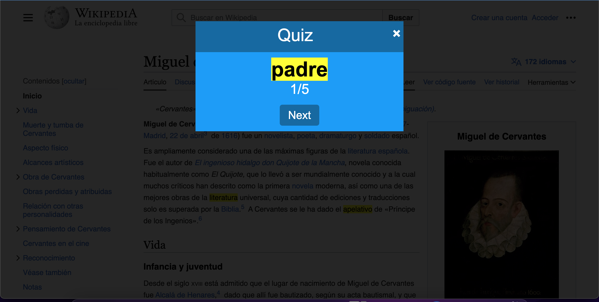
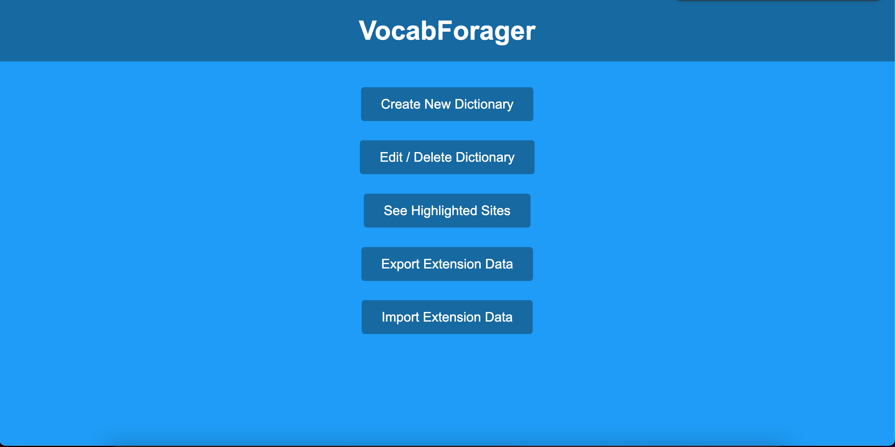

# User Manual

## Dictionaries
One of the best features of VocabForager is the flexibility it provides in choosing
dictionaries. When coming across new words, it's often useful to rely on multiple resources
when determining what a word or phrase actually means. For instance, someone reading
articles in Spanish may rely on a general Spanish dictionary, like [DRAE](https://dle.rae.es/) or
one made for a particular dialect, like [DEM](https://dem.colmex.mx/). If the reader has a
different first-language, or if they are learning, they can use some translator, like
[SpanishDict](https://www.spanishdict.com) or (Google Translate)[https://translate.google.com/].

Add dictionaries by clicking the _New Dictionary_ button in the add-on's popup and filling
in the required data in the New Dictionary page (as shown below).

To define a new dictionary, the following 3 fields are required:
- Name: a unique name by which to identify your dictionary in VocabForager
- Language: specifies the language that a dictionary is for, essentially a grouping. E.g.
[DRAE](https://dle.rae.es/) could have Spanish or Español and [Merriam-Webster](https://www.merriam-webster.com/)
would be English.
- _URL Regex_: This setting specifies how to search for text using a specific dictionary.
The user must provide a pattern (regex) that word searches for a particular word would take,
where the portion of the URL containing the searched word will be replaced with **{word}**.
For instance, the URL Regex using [WordReference](https://www.wordreference.com/definicion/)
would look like **https://www.wordreference.com/definicion/{word}**; The URL for the word "caldo" for this
website is [https://www.wordreference.com/definicion/caldo](https://www.wordreference.com/definicion/caldo).

After creating a new dictionary, It can be used by selecting it in the popup. As shown in
the image above, for instance, the current dictionary selected is "WordReference",
which is registered under the language "Español". At this point, clicking on a highlighted
word, for example "caldo", would display the web-page (https://www.wordreference.com/definicion/caldo)[https://www.wordreference.com/definicion/caldo].
Note that once a dictionary is selected from the extension popup, it is used to "define"
the highlighted-text across all web-pages opened in your browser, not just the tab you
are on.

If, you wish to remove a dictionary or modify it, say the name has a typo or its URL has
changed, You would first open the VocabForager main page using te popup and clicking "More Options"
and then click on the Edit/Delete Dictionary button. This will present you with a pair of
comboboxes where you select the language and name of a dictionary. The delete button will
remove the dictionary from VocabForager while the Edit button will show you a page similar to
the New Dictionary page, where your changes can be made and saved.

## Activate Addon

One dictionaries have been configured, you are almost ready to start using VocabForager and
highlighting words in webpages; you just need to turn the feature on :).

One can "activate" VocabForager in one of 2 ways:
1. Switching the popup's toggle button on, the one with the Activation label as shown above.
2. Pressing the extension's Activate context menu option as shown below:

Doing this will allow you to start marking text using VocabForager, looking up
definitions. Previous marks would also become visible and can be deleted when extension is
activated.

Deactivating the extension, which can be done by the two aforementioned means, remove
VocabForager marks (and the ability to create/remove them) from all webpages. It is again
worth noting that this feature (activating/deactivating) is a global to all browser tabs.

## Highlighting & Undoing

Once VocabForager has been activated, you can begin highlighting words (or phrases) from a
webpage. All one needs to do is **select** the desired text with the mouse/cursor. This
is usually done by holding onto the mouse's left button and dragging it until all desired
characters/letters are covered; if just highlighting a single word, simply double-clicking
on said word should do the trick. Once this is done, the selected text should be
surrounded by a yellow background and be the color black. Selecting the
"Change Highlight Style" context menu option (shown above) will change all highlight marks
to have dark blue backgrounds and white text. Future clicks on this menu option simply
oscillate between these two settings (nominally thought of as light and dark modes).

When hovering over highlighted text, the user can now look up the definition of said word
using the configured dictionary. This can be done simply by clicking on the highlighted text
block. Hovering over the highlight mark should create an aqua border around the text that
leaves as soon as the mouse is taken elsewhere.

Note that highlights persist across browser sessions. So if you go to a different web page
from your current tab, or even close the browser, and navigate back to the previous page,
the text you had previously highlighted should still be highlighted (after about a second
or two).

To delete a highlight mark, simply hover over the selected text and click on VocabForager's
_Delete Highlight_ context menu option, as shown below.

## Quiz

When revisiting a web page, you can quiz yourself on the words/phrases you've highlighted
by clicking the "Quiz" option. A popup will then appear on the page with highlighted text
in the middle. After making a guess as to what the text means, clicking it would open up
a dictionary tab as if you clicked on the highlight in the actual webpage. Once you've
finished guessing, move onto the next word by clicking the "Next" button. After doing this for
all highlighted text, the quiz will reset, after shuffling the words of course to hamper
memorizing patterns instead of word definitions. To leave the quiz, click the "X" on the
top right of the popup.

## Main Menu

To navigate to VocabForager's Main Menu, click on the "More Options" button in the
extension's popup. From here, you can create, edit, or delete your dictionaries, as
described above, but you can also perform other tasks, as described below.

### Revisiting Previous Sites.
#### Domain
#### Labels
### Importing/Exporting Data
If, for whatever reason, you stop using your current browser or you get a new device, the content
you have in VocabForager, all your dictionaries and webpage data, will be lost. To
transfer these over, you would need to perform the following:

1. Install VocabForager on your new browser either on whatever device you decide to use
moving forward.
2. Click the "Export Extension Data" from the Main Menu in your old browser. This will
create a file named `vocabForagerData.json` inside your Downloads folder.
3. If moving to a new device, transfer this file over.
4. In your new browser's instance of VocabForager, click the "Import Extension Data"
option in the Main Menu. Select the file created in step 2 when prompted.

Congratulations! You have successfully migrated your VocabForager data over to your new
browser.
