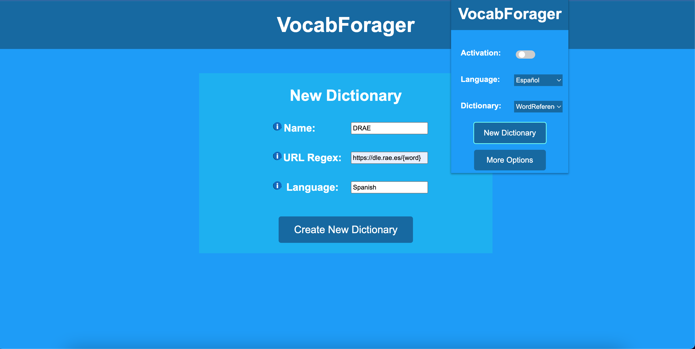

# User Manual

## Dictionaries
One of the best features of VocabForager is the flexibility it provides in choosing
dictionaries. When coming across new words, it's often useful to rely on multiple resources
when determining what a word or phrase actually means. For instance, someone reading
articles in Spanish may rely on a general Spanish dictionary, like [DRAE](https://dle.rae.es/) or
one made for a particular dialect, like [DEM](https://dem.colmex.mx/). If the reader has a
different first-language, or if they are learning, they can use some translator, like
[SpanishDict](https://www.spanishdict.com) or (Google Translate)[https://translate.google.com/].

To add dictionaries by clicking the _New Dictionary_ button in the add-on's
popup and filling in the required data in the New Dictionary page (as shown below).

    

To define a new dictionary, the following 3 fields are required:
- Name: a unique name by which to identify your dictionary in VocabForager
- Language: specifies the language that a dictionary is for, essentially a grouping. E.g.
[DRAE](https://dle.rae.es/) could have Spanish or Español and [Merriam-Webster](https://www.merriam-webster.com/)
would be English.
- _URL Regex_: This setting specifies how to search for text using a specific dictionary.
The user must provide a pattern (regex) that word searches for a particular word would take,
where the portion of the URL containing the searched word will be replaced with **{word}**.
For instance, the URL Regex using [WordReference]((https://www.wordreference.com/definicion/)
would look like **https://www.wordreference.com/definicion/{word}**; The URL for the word "caldo" for this
website is [https://www.wordreference.com/definicion/caldo](https://www.wordreference.com/definicion/caldo).

After creating a new dictionary, It can be used by selecting it in the popup. As shown in
the image above, for instance, the current dictionary selected is "WordReference",
which is registered under the language "Español". At this point, clicking on a highlighted
word, for example "caldo", would display the web-page (https://www.wordreference.com/definicion/caldo)[https://www.wordreference.com/definicion/caldo].

If, you wish to remove a dictionary or modify it, say the name has a typo or its URL has
changed, You would first open the VocabForager main page using te popup and clicking "More Options"
and then click on the Edit/Delete Dictionary button. This will present you with a pair of
comboboxes where you select the language and name of a dictionary. The delete button will
remove the dictionary from VocabForager while the Edit button will show you a page similar to
the New Dictionary page, where your changes can be made and saved.
